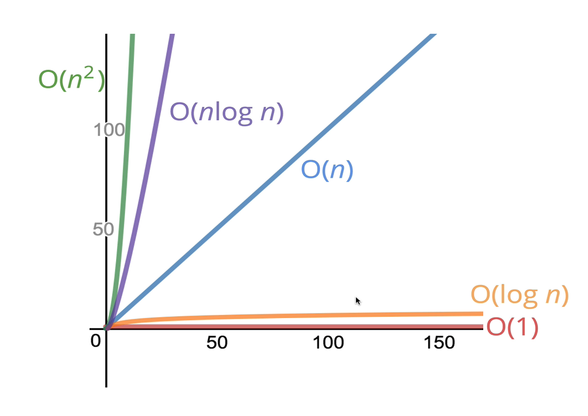
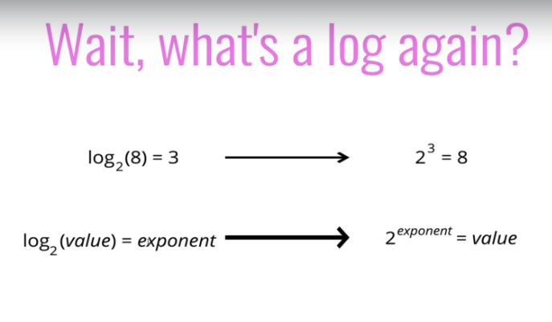
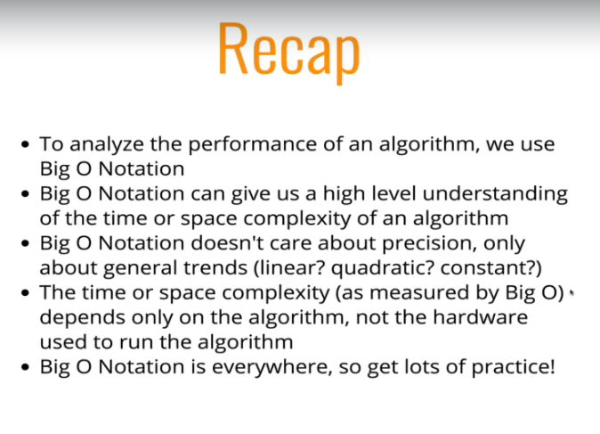

# Big O

## Big O time complexity:

It calculates the time taken to run an algorithm as the input grows.




## Big O Space complexity:

Also known as "auxiliary space complexity" to refer to space required by the algorithms NOT including space taken up by the inputs.

- ##### Most primitives are constant space like:
  + Booleans
  + Numbers
  + Undefined
  + Null

- ##### Strings requires O(n) space (where _n_ is the string)
- ##### Reference types are generally O(n), where _n_ is the length (for arrays) or the number of keys (for objects)


### Examples:
1)
```
function logUpTo(n) {
    for (var i = 1; i <= n; i++) {
        console.log(i);
    }
}
```
This is O(1) because _n_ is constant

2)
```
function onlyElementsAtEvenIndex(array) {
    var newArray = Array(Math.ceil(array.length / 2));
    for (var i = 0; i < array.length; i++) {
        if (i % 2 === 0) {
            newArray[i / 2] = array[i];
        }
    }
    return newArray;
}
```
This is O(n) because it depends on the size of _n_ or in this case the _array_ variable

## Logarithms

Most common complexities:
  + O(1)
  + O(n)
  + O(n2)




## Who Cares about logarithmic time complexity?

+ Searching algorithms have logarithmic time complexity.
+ Efficient sorting algorithms.
+ Recursion sometimes involves logarithmic space complexity.

